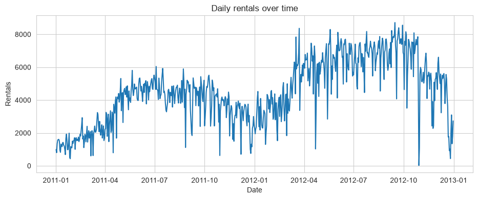
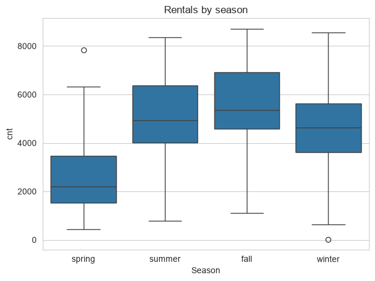
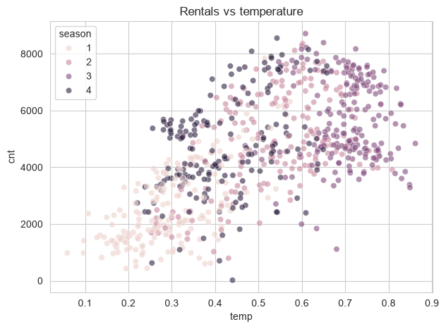
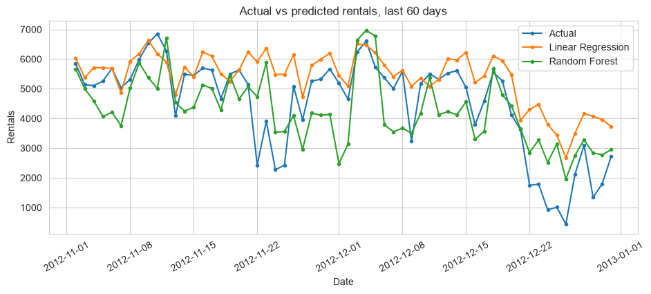
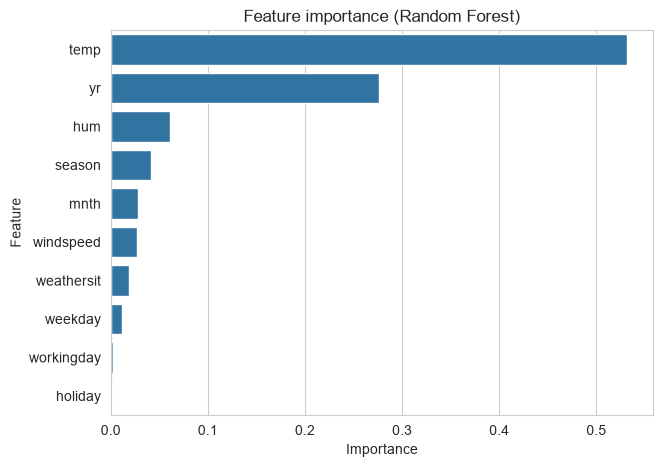

# Bike Sharing Demand Forecasting

Predicting daily bike rental counts in Washington DC using weather and calendar data.

## Problem Statement

A bike share company needs to know roughly how many bikes will get rented on a given day so they can plan things like fleet size and staffing. Too few bikes available on a busy day means lost revenue and annoyed customers, too many sitting idle on a slow day is wasted cost. This project builds a model that forecasts daily rental demand from the date and weather conditions.

## Objectives

- Explore the seasonal and weekly patterns in bike rentals
- Handle a data leakage issue in the raw dataset
- Build a proper time based train/test split instead of a random one
- Compare a baseline regression model against a more complex one
- Evaluate with regression metrics and figure out what actually drives demand

## Dataset

[UCI Bike Sharing Dataset](https://archive.ics.uci.edu/dataset/275/bike+sharing+dataset), daily bike rental counts from Capital Bikeshare in Washington DC, 731 days covering 2011 and 2012, with weather (temperature, humidity, windspeed), season, holiday and working day info included.

Citation: Fanaee-T, Hadi, and Gama, Joao, "Event labeling combining ensemble detectors and background knowledge", Progress in Artificial Intelligence (2013).

## Technologies Used

Python, pandas, NumPy, matplotlib, seaborn, scikit-learn

## Project Structure

```
bike-demand-forecasting/
├── README.md
├── data/
│   ├── day.csv
│   └── Readme.txt
├── notebooks/
│   └── bike_demand_forecasting.ipynb
├── results/
│   └── charts exported from the notebook
├── requirements.txt
└── .gitignore
```

## Data Cleaning

The dataset has `casual` and `registered` columns which add up exactly to `cnt`, the target. Using either of those as a feature wouldve been data leakage since the model wouldve basically been given the answer, so both got dropped. Also dropped `atemp` since its correlated with `temp` at over 0.99, its "feels like" temperature and basically measures the same thing.

## Exploratory Data Analysis

- Rentals follow a clear yearly cycle, low in winter, peaks in summer/fall.
- 2012 had noticeably more rentals than 2011 overall, not just seasonal, the service seems to have grown year over year.
- Day of week pattern is surprisingly weak, rentals are fairly similar Mon-Sun with maybe a small dip Sunday. Probably because commuters and weekend leisure riders roughly balance out.
- Temperature has a strong relationship with rentals, more rentals on warmer days, up to a point where it looks like it levels off.

| Rentals over time | Rentals by season | Rentals vs temperature |
|---|---|---|
|  |  |  |

## Feature Engineering

Most of the useful features were already provided as clean integer codes (season, month, weekday, weathersit), so not much extra engineering was needed here. `dteday` was converted to an actual datetime so it could be used for sorting and the time based split, then dropped as a raw model feature since the season/month/weekday columns already capture the useful calendar info.

## Methodology

This is time series data so a random train/test split doesnt make sense, that wouldve let the model see rows from after the test period during training, which isnt realistic. Instead the last 60 days were held out as the test set and everything before that used for training, same as how the model would actually be used in practice.

One limitation to flag here: the last 60 days happens to fall entirely in late fall/winter, so this evaluation doesnt really tell us how well the model would do forecasting the busy summer season.

## Models Used

- **Linear Regression**, the baseline.
- **Random Forest Regressor**, tried next to see if it captures non linear effects like temperature having a sweet spot instead of a straight line relationship with rentals.

## Model Evaluation

| Model | MAE | RMSE | R² |
|---|---|---|---|
| Linear Regression | 947 | 1331 | 0.295 |
| Random Forest | 953 | **1143** | **0.480** |

Random Forest wins clearly on RMSE and R², MAE is basically tied though, actually very slightly worse for Random Forest. RMSE punishes big misses harder than MAE does, so this suggests Random Forest is avoiding the occasional huge miss that Linear Regression makes, while having a similar typical error size on a normal day.



The plot backs this up, Random Forest follows the real day to day ups and downs a lot closer, Linear Regression basically gives a smoother, less reactive line and misses the sharp dip in late December (likely a weather event) a lot worse.

## Key Findings



`yr` and `temp` are the two biggest predictors by far. `yr` is basically capturing the overall year over year growth, `temp` makes sense given how strong that relationship looked in the EDA. Season and weathersit matter too but a lot less than those two.

## Limitations

- R² of 0.48 for Random Forest means under half the day to day variance is explained, theres clearly other stuff going on (local events, random daily noise) that these features dont capture.
- The 60 day test period only covers one season (winter), so this doesnt tell us how well the model forecasts the busier summer months. A more rigorous evaluation wouldve tested across a few different time windows.
- No hyperparameter tuning beyond a reasonable manual guess (max_depth=8, n_estimators=300).
- No lag features (like yesterdays rental count) were used, which usually help a lot in demand forecasting.

## Future Improvements

- Add lag features (previous day/week rentals) and rolling averages
- Backtest across multiple time windows instead of one fixed holdout, to check performance across different seasons
- Try a proper time series model (like Prophet or SARIMA) for comparison
- Hyperparameter tuning with time series cross validation (can't use regular k-fold here since order matters)

## How to Run the Project

```bash
git clone https://github.com/amirajsingh6/bike-demand-forecasting.git
cd bike-demand-forecasting

python -m venv .venv
source .venv/bin/activate   # Windows: .venv\Scripts\activate

pip install -r requirements.txt
jupyter notebook notebooks/bike_demand_forecasting.ipynb
```
